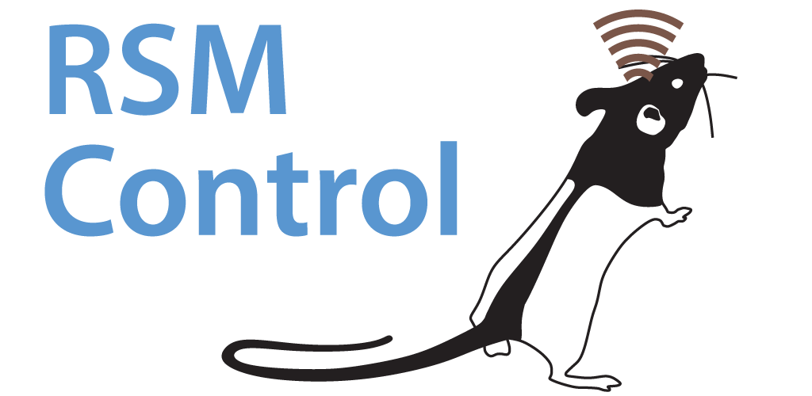

Rodent Stimulation Module Project
=========

Rodent-scale open source programmable constant current deep brain stimulation system. Runs on a
low power MSP430 microcontroller from Texas Instrumnents. Interfaces with an Android app using
Near Field Communication (NFC).

   - The [Firmware/](Firmware/) directory contains the code which runs on the MSP430. 
   - The [AppCode/](AppCode/) directory contains the Android Studio project and code for the
     NFC controller app.
   - The [PCBs/](PCBs/) directory contains the design files for the printed circuit board
     hardware.

Developed by members of the [Kemere Lab](http://rnel.rice.edu) at Rice University.

