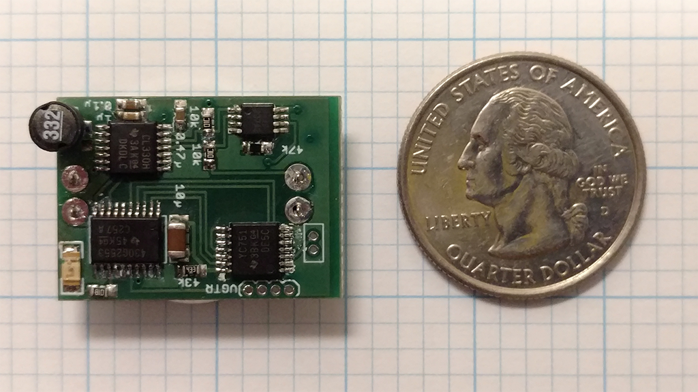
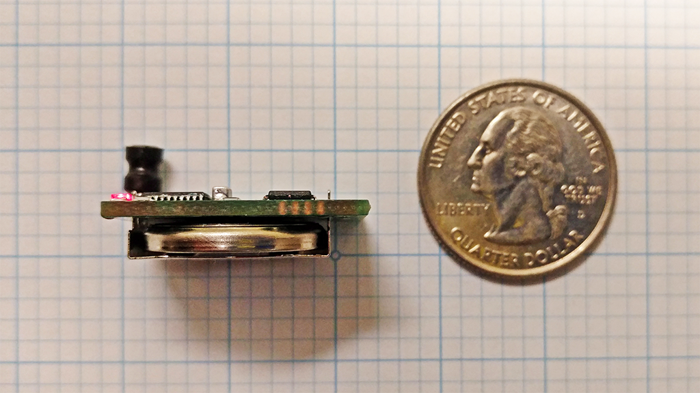

Rodent Stimulation Module Project
=========

Rodent-scale open source programmable constant current deep brain stimulation system. Runs on a
low power MSP430 microcontroller from Texas Instrumnents. Interfaces with an Android app using
Near Field Communication (NFC).

   - The [Firmware/](Firmware/) directory contains the code which runs on the MSP430. 
   - The [AppCode/](AppCode/) directory contains the Android Studio project and code for the
     NFC controller app.
   - The [PCBs/](PCBs/) directory contains the design files for the printed circuit board
     hardware.

#### Physical Size of Devices In Action
 

The most recent version of the hardware is about 1/4" thick including a CR2032 battery, and a
little larger than a quarter in footprint. Battery life is about 200 hours.

#### Biphasic Constant Current Stimulation
 

Current measurements (voltage over the series 10 K resistor)
for a 90 µA, 60 µs, 120 Hz stimulation settings.

Developed by members of the [Kemere Lab](http://rnel.rice.edu) at Rice University.

